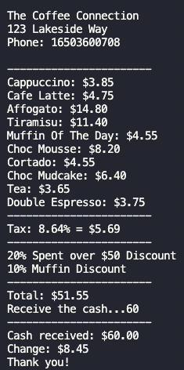

# The Coffee Connection

  
***


### The problem - User story:
```
As a cashier,
I want to add the items of my clients
So that I can control my clients' order

As a cashier,
I want to view a list of all the items
So that I can control my clients' order

As a cashier, 
I want to know if the client ordered a muffin
So that I can give them a discount

As a cashier, 
I want to know if the client ordered more than $50
So that I can give them a discount

As a cashier, 
I want to receive the payment
So that I can give them a change
```
### How did I approach designing my solution to the problem?
As a cashier from a takeaway cafe who receives one order at a time, the cashier gets the customer's demand, places the order and receives the payment. That way, I created two classes: The first class gets the order with the items, and the other class does the discount calculations and payment receipt. The user interface is via the command line.


### How did I structure my code, and why did I in this way?
I opened an MD file and wrote what needed to be done. I wrote the main functions and test examples. Then I added a test, waited for the test to fail, wrote my code, waited for the test to pass, and refactored the code myself. And so I did for each function I needed to add to satisfy the user with my code. 


### How to install and run my code and tests?
```
nvm use node
npm init -y
npm add jest
npm install -g jest
node app.js

jest
```


### Screenshot of the output

